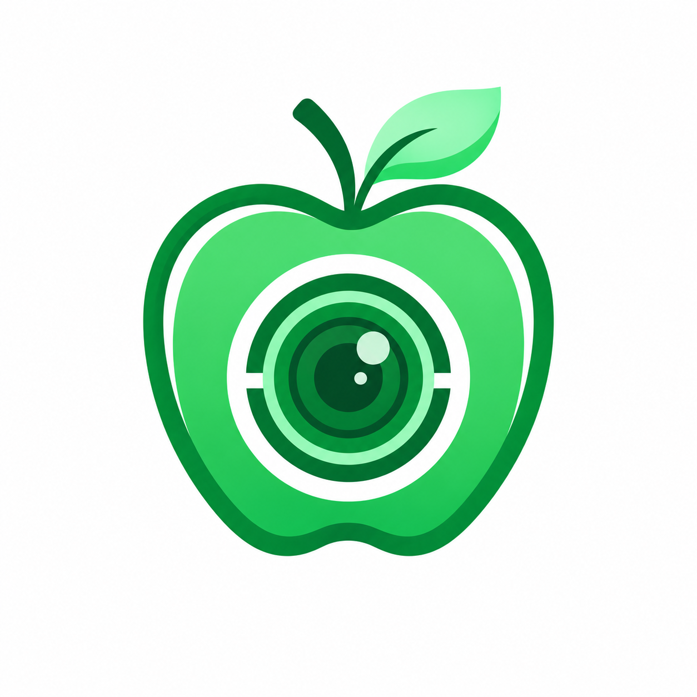
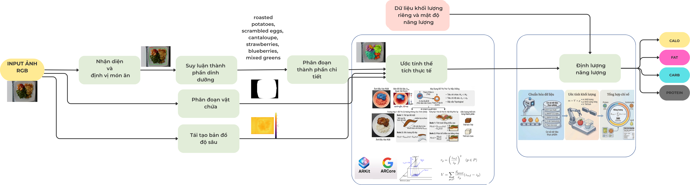
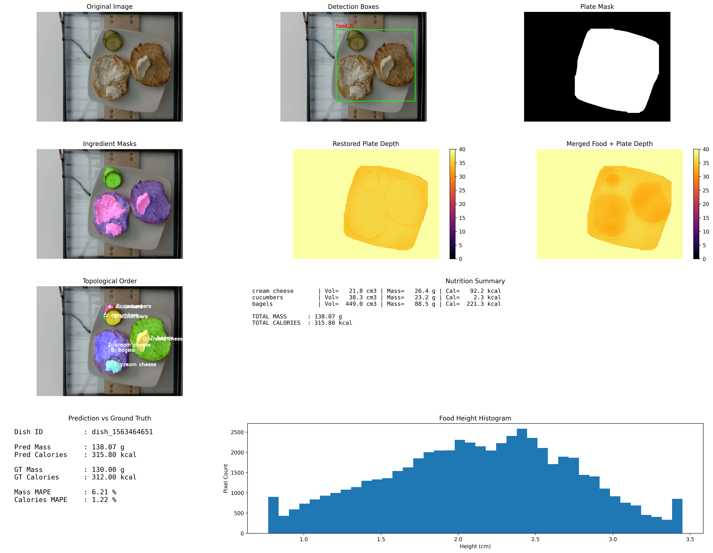
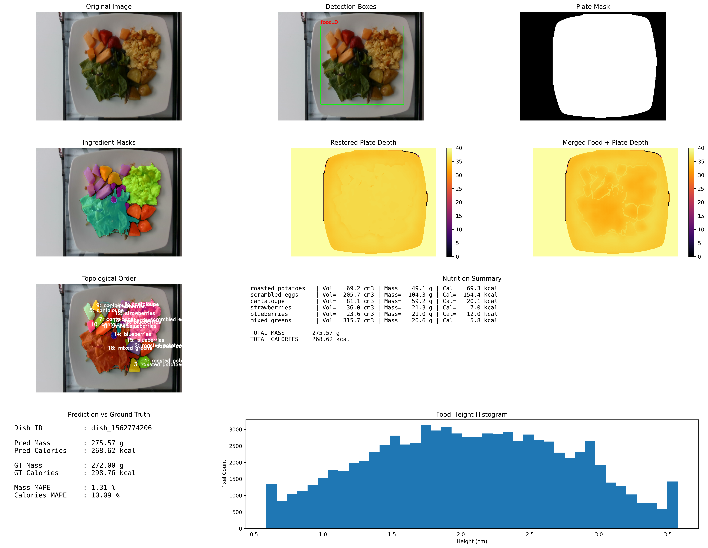

<p align="center">
  
</p>

<h1 align="center">NutriLens AI Server</h1>

<p align="center">
  AI inference service for the graduation project <strong>"Building a 2D Food Image-Based Calorie Estimation System"</strong>
</p>

<p align="center">
  
  
  
  
</p>

## Pipeline Overview

<p align="center">
  
</p>

## AI Output Demo

<p align="center">
  
  
</p>

## Overview

NutriLens AI Server is the image analysis service in the NutriLens system. It receives a 2D food image and camera metadata from the backend, runs a deep learning-based computer vision pipeline, and returns ingredient components, segmentation masks, and estimated volumes. The backend then performs nutrition-data matching, weight estimation, calorie calculation, and meal persistence.

The scientific focus of this project is to recover missing spatial information from a single-view 2D food image. NutriLens combines multiple modern foundation vision models instead of relying on fixed reference objects or specialized hardware such as LiDAR/depth cameras. On the Nutrition5K benchmark, the integrated system achieved **69.23 kCal MAE** and **27.36% MAPE**.

## AI Pipeline

1. **Food & Plate Detection**: YOLO detects food regions and containers to reduce background noise.
2. **Ingredient Reasoning**: Qwen3-VL infers likely food ingredients from visual context.
3. **Instance Segmentation**: SAM3 LoRA produces pixel-level masks for each ingredient.
4. **Monocular Depth Estimation**: Depth Anything V2 estimates depth from a single 2D image.
5. **Depth Scaling & Geometry**: camera metadata, anchor distance, or client-provided depth maps are used to normalize spatial scale.
6. **Volume Estimation**: geometric integration over segmented masks estimates ingredient-level volume.
7. **Response Building**: masks are uploaded to Cloudinary or stored locally, then normalized results are returned to the backend.

## Tech Stack

- Python, FastAPI, Pydantic Settings
- PyTorch, CUDA
- Ultralytics YOLO
- Qwen3-VL
- SAM3 LoRA
- Depth Anything V2
- OpenCV, NumPy, scikit-image, SciPy
- Cloudinary
- Pytest

## Project Structure

```text
app/
  api/v1/       Analysis endpoint
  core/         Configuration, logging, constants
  exceptions/   Business and inference exceptions
  schemas/      Request/response schemas
  services/     Detection, extraction, segmentation, depth, geometry, storage
  utils/        Image-processing, math, and visualization utilities
models/         Foundation-model and LoRA source/reference files
tests/          Unit and smoke tests
weights/        Model weights; large files should not be committed directly
docs/assets/    Logo, pipeline, and AI demo assets used by this README
```

## Local Setup

A CUDA-enabled NVIDIA GPU is recommended for practical inference.

```bash
python -m venv .venv
source .venv/bin/activate
pip install --upgrade pip
pip install -r requirements.txt
```

Create a `.env` file if you need to override the default settings:

```env
DEVICE=auto
LOG_LEVEL=INFO

YOLO_FOOD_WEIGHTS=weights/yolo/food_yolo.pt
YOLO_FOOD_CONF=0.8
YOLO_PLATE_WEIGHTS=weights/yolo/plate_yolo_seg.pt
YOLO_PLATE_CONF=0.8

QWEN3VL_WEIGHTS=weights/qwen3vl
SAM3_CONFIG_PATH=weights/sam3/food_config.yaml
SAM3_WEIGHTS=weights/sam3/sam3_lora.pt
SAM3_CONF=0.7

DEPTH_ENCODER=vits
DEPTHANYTHING_WEIGHTS=weights/da2/depth_anything_v2_vits

MODEL_VERSION=seg-nutrition-v1
MASK_LOCAL_DIR=logs/masks
CLOUDINARY_CLOUD_NAME=
CLOUDINARY_API_KEY=
CLOUDINARY_API_SECRET=
CLOUDINARY_MASK_FOLDER=nutrilens/inference/jobs
```

## Running the API

```bash
uvicorn app.main:app --host 0.0.0.0 --port 8001
```

Swagger UI:

```text
http://localhost:8001/docs
```

## Main Endpoint

`POST /v1/analyze`

The request uses `multipart/form-data`:

- `image`: food image.
- `job_id`: backend-generated inference job ID.
- `camera_metadata`: JSON string containing camera metadata, intrinsics, height/anchor distance, and optional depth metadata.
- `depth_map`: optional client-provided depth map.

Example response:

```json
{
  "model_version": "seg-nutrition-v1",
  "latency_ms": 1240,
  "components": [
    {
      "component_id": "comp_001",
      "component_name": "White rice",
      "mask_path": "https://res.cloudinary.com/.../comp_001.png",
      "volume": 180.5
    }
  ]
}
```

## Tests

```bash
pytest
```

## Deployment Notes

- `DEVICE=auto` selects CUDA when available and falls back to CPU otherwise.
- Large model weights should be managed outside Git when they exceed repository limits.
- When `DEBUG_VISUALS=True`, the server generates additional debugging images for technical inspection; they are not part of the client response.
- The backend should point to `http://<ai-server-host>:8001/v1/analyze`.

## Related Repositories

- AI Server: https://github.com/IloveUhiuhiu/nutrilens-ai-server
- Backend Server: https://github.com/IloveUhiuhiu/nutrilens-backend
- Web Admin Interface: https://github.com/IloveUhiuhiu/nutrilens-web-frontend
- Mobile Application: https://github.com/IloveUhiuhiu/nutrilens-mobile-app

## Contributors

- **Dang Phuc Long** - Class 22T_DT4 - Faculty of Information Technology
- **Nguyen Duc Nha** - Class 22T_KHDL
- **Truong Bui Dien** - Class 24T_KHDL
